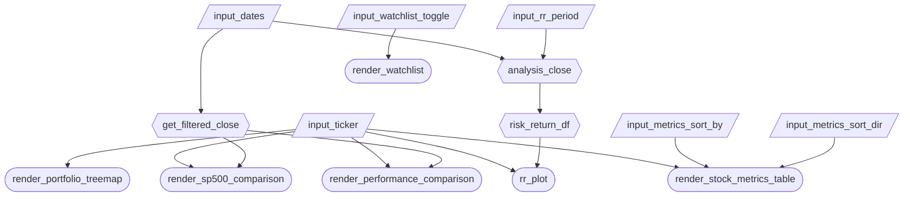

# Phase 2: App Specification

---

## 2.1 Updated Job Stories

| # | Job Story | Status | Notes |
|---:|---|:---:|---|
| 1 | When I want to compare Magnificent 7 companies, I want to view their key valuation and growth metrics side-by-side so I can quickly rank and evaluate them. | ✅ Implemented | Focus: sortable table based on metrics. |
| 2 | When I analyze investment tradeoffs, I want to see a risk vs return scatter plot so I can understand how volatility relates to performance across companies. | ✅ Implemented | Hover tooltip should display ticker, return, and volatility. |
| 3 | Portfolio Visualization: As an investor, when I select a stock from the Magnificent 7, I want to see its relative market capitalization compared to other companies in a treemap, so that I can understand the size and weight of each company in the portfolio at a glance. | ✅ Implemented | Implemented as component 7 (Portfolio Treemap), highlights selected stock in blue. |
| 4 | Watchlist Tracking: As an investor, when I monitor my watchlist stocks, I want to see their latest price changes in both dollar and percentage formats (togglable), so that I can quickly assess performance and decide whether to buy or sell. | ✅ Implemented | Implemented as component 8 (Watchlist), uses color-coded changes (green/red). |
| 5 | Performance Comparison: As an investor I want to compare historical stock performance across the Magnificent 7, so that I can identify which companies are leading or lagging over a selected time period, and also compare these stocks to the S&P 500 so I can understand how top tech stocks compare. | ✅ Implemented | No changes needed, accounted for by components 3 and 4. |

---

## 2.2 Component Inventory

| ID | Type | Shiny widget / renderer | Depends on | Job story |
|---|---|---|---|---|
| `ticker` | Input | `ui.input_selectize()` | — | #1, #2, #3, #5 |
| `dates` | Input | `ui.input_date_range()` | — | #2, #5 |
| `rr_period` | Input | `ui.input_select()` (Full, 1Y, 5Y, 10Y) | — | #2 |
| `metrics_sort_by` | Input | `ui.input_select()` | — | #1 |
| `metrics_sort_dir` | Input | `ui.input_radio_buttons()` | — | #1 |
| `watchlist_toggle` | Input | `ui.input_switch()` | — | #4 |
| `get_filtered_close` | Reactive calc | `@reactive.calc` | `dates` | #5 |
| `analysis_close` | Reactive calc | `@reactive.calc` | `dates`, `rr_period` | #2 |
| `risk_return_df` | Reactive calc | `@reactive.calc` | `analysis_close` | #2 |
| `render_stock_metrics_table` | Output | `@render.data_frame` → `render.DataGrid` | `metric_df`, `metrics_sort_by`, `metrics_sort_dir` | #1 |
| `rr_plot` | Output | `@render_plotly` | `risk_return_df`, `ticker` | #2 |
| `render_portfolio_treemap` | Output | `@render_plotly` | `ticker` | #3 |
| `render_watchlist` | Output | `@render.data_frame` | `watchlist_toggle` | #4 |
| `render_performance_comparison` | Output | `@render_plotly` | `get_filtered_close`, `ticker` | #5 |
| `render_sp500_comparison` | Output | `@render_plotly` | `get_filtered_close`, `ticker`, `dates` | #5 |

---

## 2.3 Reactivity Diagram

---

## 2.4 Calculation Details

### `get_filtered_close`

**Inputs:** `input_dates`

**Transformation:**
Filters the full historical closing price dataset (`close.csv`) to only the rows within the selected date range. No further windowing is applied — this is the base filtered dataset used by the performance charts.

**Used by:** `render_performance_comparison`, `render_sp500_comparison`

---

### `analysis_close`

**Inputs:** `input_dates`, `input_rr_period`

**Transformation:**
Filters `close.csv` to the selected date range, then applies the risk/return window (`rr_period`): Full, 1Y, 5Y, or 10Y. If Full is selected, the entire filtered range is used. Otherwise, only the most recent N years within the selected range are kept. This produces the final price window used for risk and return calculations.

**Used by:** `risk_return_df`

---

### `risk_return_df`

**Inputs:** `analysis_close`

**Transformation:**
Computes daily percentage returns for each ticker from the filtered price data, then calculates annualized return (`mean_daily * 252`) and annualized volatility (`std_daily * sqrt(252)`). Outputs a summary dataframe with one row per stock.

**Used by:** `rr_plot`

---

### Outputs (no separate reactive calc)

**`render_stock_metrics_table`** — Reads `metric_df` directly. Sorts by the selected metric (`metrics_sort_by`) in the selected order (`metrics_sort_dir`) before formatting and displaying values.

**`rr_plot`** — Consumes `risk_return_df` and `input_ticker`. Renders a scatter plot of annualized volatility vs annualized return, with the selected ticker visually highlighted.

**`render_portfolio_treemap`** — Reads `metric_df` directly. Sizes tiles by market cap, highlights the selected ticker in blue.

**`render_watchlist`** — Reads `wishlist_df` directly. Computes the most recent day-over-day price change per watchlist stock and displays it in dollar or percentage format based on `watchlist_toggle`, color-coded green/red.

**`render_performance_comparison`** — Consumes `get_filtered_close` and `input_ticker`. Normalizes all stock prices to 100 at the start of the date range and plots multi-line performance, highlighting the selected ticker.

**`render_sp500_comparison`** — Consumes `get_filtered_close`, `input_ticker`, and `input_dates`. Normalizes the selected stock and SPY to 100 and plots both lines for direct comparison.