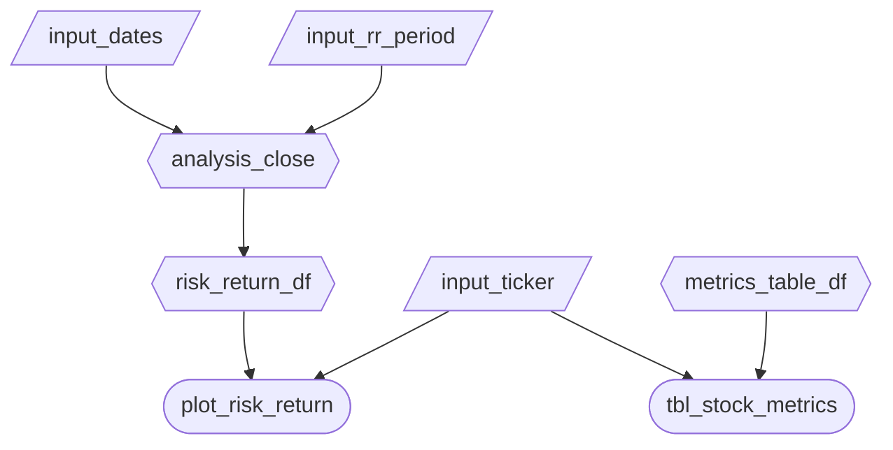

# Phase 2: App Specification (M2)

This document is a specification for our Shiny dashboard. It will be updated in M3 and M4 as the implementation evolves.

## 2.1 Updated Job Stories

| # | Job Story | Status | Notes |
|---:|---|:---:|---|
| 1 | When I want to compare Magnificent 7 companies, I want to view their key valuation and growth metrics side-by-side so I can quickly rank and evaluate them. | ⏳ Pending M3 | Focus: sortable table with selected ticker highlighted. |
| 2 | When I analyze investment tradeoffs, I want to see a risk vs return scatter plot so I can understand how volatility relates to performance across companies. | ⏳ Pending M3 | Hover tooltip should display ticker, return, and volatility. |

---

## 2.2 Component Inventory

This inventory reflects the final Express-based architecture (inputs → reactive calculations → outputs).

| ID | Type | Shiny widget / renderer | Depends on | Job story |
|---|---|---|---|---|
| `ticker` | Input | `ui.input_selectize()` | — | #1, #2 |
| `dates` | Input | `ui.input_date_range()` | — | #2 |
| `rr_period` | Input | `ui.input_select()` (Full, 1Y, 5Y, 10Y) | — | #2 |
| `analysis_close` | Reactive calc | `@reactive.calc` | `dates`, `rr_period` | #2 |
| `risk_return_df` | Reactive calc | `@reactive.calc` | `analysis_close` | #2 |
| `metrics_sort_by` | Input | `ui.input_select()` | — | #1 |
| `metrics_sort_dir` | Input | `ui.input_radio_buttons()` | — | #1 |
| `render_stock_metrics_table` | Output | `@render.data_frame` → `render.DataGrid` | `metric_df`, `metrics_sort_*` | #1 |
| `rr_plot` | Output | `output_widget()` + `@render_plotly` | `risk_return_df`, `ticker` | #2 |

---

## 2.3 Reactivity Diagram

---

## 2.4 Calculation Details

### `analysis_close`

**Inputs:** `input_dates`, `input_rr_period`  

**Transformation:**  
This reactive calculation filters the historical closing price dataset (`close.csv`) to the selected date range (`input_dates`). It then applies the selected risk/return window (`input_rr_period`): Full, 1Y, 5Y, or 10Y.  

If **Full** is selected, the entire filtered range is used.  
If 1Y, 5Y, or 10Y is selected, only the most recent N years within the selected range are kept.  

The resulting dataset is the final price window used for risk and return calculations.

**Used by:** `risk_return_df`

---

### `risk_return_df`

**Input:** `analysis_close`  

**Transformation:**  
Using the filtered price data, this reactive calculation computes daily percentage returns for each ticker. It then calculates:

- Annualized return  
- Annualized volatility  

The output is a summary dataframe with one row per stock containing its annualized return and volatility based on the selected window.

**Used by:** `rr_plot`

---

### `rr_plot`

**Inputs:** `risk_return_df`, `input_ticker`  

**Transformation:**  
Renders the risk–return scatter plot using annualized volatility (x-axis) and annualized return (y-axis).  

Both axes are formatted as percentages. The selected stock (`input_ticker`) is visually emphasized.

---

### `render_stock_price_chart`

**Inputs:** `input_ticker`, `input_dates`  

**Transformation:**  
Displays the selected stock’s closing price over the chosen date range.  

The chart updates whenever the ticker or date range changes.

---

### `render_stock_metrics_table`

**Inputs:** `metrics_sort_by`, `metrics_sort_dir`  

**Transformation:**  
Prepares and sorts the snapshot valuation dataset from `metric.csv`.  

The full dataset is always displayed. Rows can be reordered based on the selected metric and order. Fundamental values remain constant since only the latest snapshot is available.

The row will be highlighted if the user select. 

**Used by:** `render_stock_metrics_table`